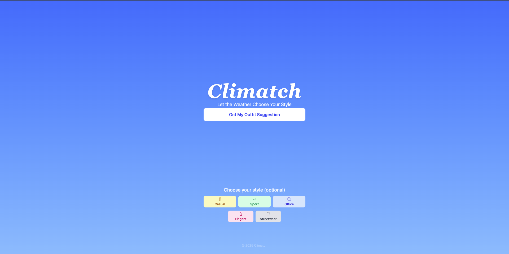
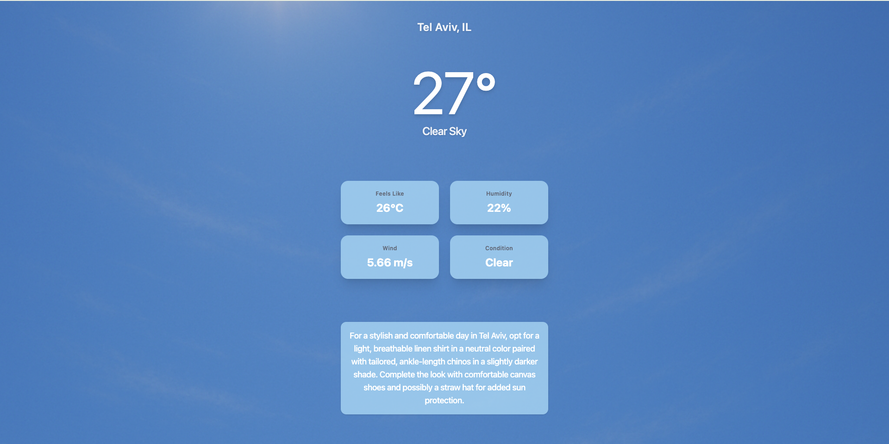
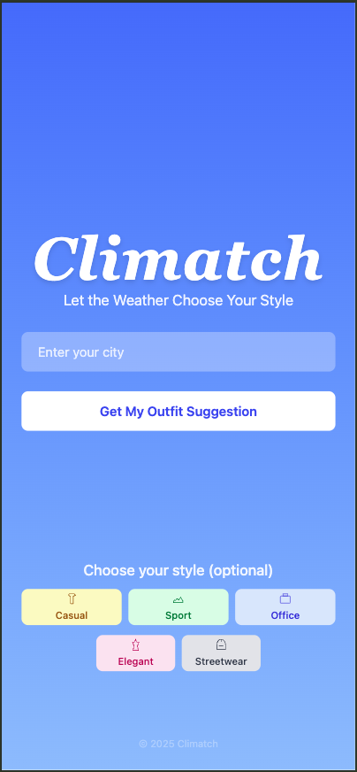
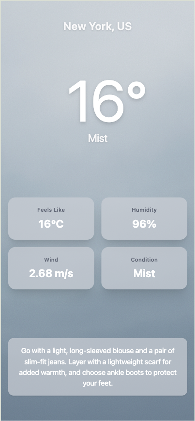

# Climatch

An AI-enhanced weather-based outfit suggestion app that helps you dress right for the day based on live weather data.

> ✅ Automatically detects your location and gives you personalized outfit recommendations instantly!
>
> ✅ Or enter your city manually and get the same magic, no matter where you are.

🚀 **Live Demo:** This app is hosted on Render (free tier). The backend may take up to 30 seconds to wake up after inactivity, during which a loading screen will be shown.
👉 [https://climatch-dusky.vercel.app](https://climatch-dusky.vercel.app)

---

## ✨ Features

### 🤖 AI-Powered Suggestions

* Uses a lightweight AI model to generate outfit suggestions tailored to weather conditions
* Combines live weather data with pre-trained logic to enhance personalization
* Powered by the **OpenRouter API**, which provides access to hosted models

### ☀️ Real-Time Weather Detection

* Automatically detects your location (with permission)
* Option to manually enter a city if location is blocked or denied
* Responsive error messages for common geolocation failures

### 🌞 Outfit Suggestion

* Recommends outfits based on the current weather condition
* Dynamic background visuals based on sky condition (e.g., Clear, Snow, Rain)
* Sleek loading animation while fetching data

### ⛈️ Weather API Integration

* Integrates with **OpenWeather API** for up-to-date forecast
* Backend handles rate-limiting and region formatting using ISO country codes

---

## 📸 Screenshots

> Below are snapshots from the app in action:

### 🖥️ Desktop Views

#### Home Page



#### Weather Page



### 📱 Mobile Views

#### Home Page - Manual City Input



#### Weather Page



---

## 📂 Technologies

### Frontend

* React + Vite
* Tailwind CSS
* Axios
* React Router DOM
* Notyf (Notifications)

### Backend

* Node.js + Express
* Axios
* dotenv
* express-rate-limit
* cors
* i18n-iso-countries

---

## 📁 Project Structure

```
Climatch/
├── package.json
├── .gitignore
├── frontend/
├── .env.example
│   ├── public/
│   │   └── background/
│   │       ├── Clear.png
│   │       ├── Rain.png
│   │       └── ...
│   └── src/
│       ├── index.css
│       ├── main.jsx
│       ├── App.jsx
│       ├── utils/
│       │   ├── api.js
│       │   ├── location.js
│       │   └── WeatherContext.jsx
│       ├── components/
│       │   └── Loading.jsx
│       └── pages/
│           ├── Home.jsx
│           ├── WakeUp.jsx
│           ├── Weather.jsx
│           └── NotFound.jsx
├── backend/
│   ├── package.json
│   ├── .gitignore
│   ├── .env.example
│   └── src/
│       ├── index.js
│       ├── routes/
│       │   └── weather.js
│       ├── controllers/
│       │   └── weather.js
│       └── utils/
│           └── rateLimiter.js
```

---

## 🚀 Installation & Setup

### 1. Clone the repository

```bash
git clone https://github.com/barak7821/climatch.git
```

### 2. Navigate into the project folder

```bash
cd climatch
```

### 3. Install dependencies (run from **root** folder)

```bash
npm install
```

**Make sure to run this from the root directory.** This will install dependencies in both `frontend/` and `backend/` via root scripts.

### 4. Create environment files

#### Backend `.env`

```env
OPENWEATHER_API_KEY=your_openweather_key
OPENROUTER_API_KEY=your_openrouter_key
```

#### Frontend `.env`

```env
VITE_BACKEND_URL=your-backend-url
```

### 5. Run the application (from **root** folder)

```bash
npm run dev
```

This will start both frontend and backend using **concurrently**. The frontend output appears in blue, backend in green.

---

Thanks for checking out Climatch! Stay comfortable, whatever the weather. ☀️🌧️
